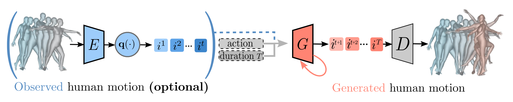

# PoseGPT: Quantization-based 3D Human Motion Generation and Forecasting [ECCV 2022]

[](./)



> [**PoseGPT: Quantization-based 3D Human Motion Generation and Forecasting**](./),            
> [Thomas Lucas*](https://europe.naverlabs.com/people_user/thomas-lucas/),
> [Fabien Baradel*](https://fabienbaradel.github.io/),
> [Philippe Weinzaepfel](https://europe.naverlabs.com/people_user/philippe-weinzaepfel/),
> [Grégory Rogez](https://europe.naverlabs.com/people_user/gregory-rogez/)       
> *European Conference on Computer Vision (ECCV), 2022*

Pytorch training and evaluation code for PoseGPT on BABEL.

## Install
Our code is running using python3.7 and requires the following packages:

- pytorch-1.7.1+cu110
- pytorch3d-0.3.0
- torchvision
- opencv
- PIL
- numpy
- smplx
- einops
- roma

We do not provide support for installation.

## Pre-process the data
You should have AMASS files and BABEL annotations in two seperate repository following this structure:
```
<babel_dir>
    |--- train.json
    |--- val.json
    |--- test.json

<amass_dir>
    |--- smplx
            |--- ACCAD # and then it follows the standard AMASS data structure
            |--- ...
            |--- SSM
    |--- smplh
            |--- ACCAD
            |--- ...
            |--- SSM
```

Then you can preprocess the data by running the following command and it will create files from the root directories <mocap_dir>
```
babel_dir='/gfs-ssd/project/humans/BABEL/babel_v1.0_release'
amass_dir='/gfs-ssd/project/humans/amass'
mocap_dir='/scratch/1/user/fbaradel/posegpt/preprocessed_data'
list_split=( 'train' 'test' 'val' )
list_type=( 'smplx' 'smplh' )
for split in "${list_split[@]}"
do
    for type in "${list_type[@]}"
    do
        echo ${type}
        echo ${split}
        python dataset/preprocessing/babel.py "prepare_annots_trimmed(type='${type}',split='${split}',mocap_dir='${mocap_dir}',babel_dir='${babel_dir}',amass_dir='${amass_dir}')"
    done
done
```

Once the preprocessing is done you should have a data structure such that:
```
<mocap_dir>
    |--- <type> # smplh or smplx
            |--- babel_trimmed
                            |--- <split>_60 # for train, val and test
                                    |--- seqLen64_fps30_overlap0_minSeqLen16
                                                                    |--- pose.pkl
                                                                    |--- action.pt
```


## Train a transformer based classifier using smpl parameters as input:

For computing the FID we first need to train a classifier on BABEL:
```
python3 classify.py --name classifier_ -iter 1000 --classif_method TR -lr 4e-5 --use_bm 0
```

## Train the auto_encoder
Different variants exists for the auto-encoder, using the following command you can train the one you want

- Train auto_encoder in debug setting (e.g to debug with a different VQVAE architecture)
```
python3 auto_encode.py  --name auto_encoder_debug --n_codebook 2 --n_e 512 --e_dim 256 --loss l2 --model CausalVQVAE --dropout 0 --freq_vert 2 --learning_rate 5e-5 --alpha_vert 100. --ab1 0.95 --tprop_vert 0.1 --prefetch_factor 4  --alpha_codebook 1. --hid_dim 384 --alpha_codebook 0.25 --train_batch_size 64 --debug 1 --dummy_data 1
```
- Train an offline (i.e all timesteps generated simultaneously), transformer based VQ-VAE
```
python3 auto_encode.py  --name auto_encoder --n_codebook 2 --n_e 512 --e_dim 256 --loss l2 --model CausalVQVAE --dropout 0 --freq_vert 2 --learning_rate 5e-5 --alpha_vert 100. --ab1 0.95 --tprop_vert 0.1 --prefetch_factor 4  --alpha_codebook 1. --hid_dim 384 --alpha_codebook 0.25 --train_batch_size 64
```
- Train a transformer based VQ-VAE, with causality in the encoder but not in the decoder (can condition on past observations):
```
python3 auto_encode.py  --name auto_encoder --n_codebook 2 --n_e 512 --e_dim 256 --loss l2 --model CausalVQVAE --dropout 0 --freq_vert 2 --learning_rate 5e-5 --alpha_vert 100. --ab1 0.95 --tprop_vert 0.1 --prefetch_factor 4  --alpha_codebook 1. --hid_dim 384 --alpha_codebook 0.25 --train_batch_size 64
```
- Train a transformer based VQ-VAE autoencoder, with causality in the encoder and in the decoder (can predict future given past on the fly):
```
python3 auto_encode.py  --name auto_encoder --n_codebook 2 --n_e 512 --e_dim 256 --loss l2 --model CausalVQVAE --dropout 0 --freq_vert 2 --learning_rate 5e-5 --alpha_vert 100. --ab1 0.95 --tprop_vert 0.1 --prefetch_factor 4  --alpha_codebook 1. --hid_dim 384 --alpha_codebook 0.25 --train_batch_size 64
```

## Train the generator
Once the auto-encoder is trained, it is available to train the generator.
- Train a generator (using a previously trained autoencoder)
```
python3 train_gpt.py  --name generator --n_codebook 2 --n_e 512 --e_dim 256  --vq_model CausalVQVAE --hid_dim 384 --dropout 0  --vq_ckpt ./logs/auto_encoder_debug/checkpoints/best_val.pt --model poseGPT --n_visu_to_save 2 --class_conditional 1 --gpt_blocksize 512 --gpt_nlayer 8 --gpt_nhead 4 --gpt_embd_pdrop 0.2 --gpt_resid_pdrop 0.2 --gpt_attn_pdrop 0.2 --seq_len 64 --gen_eos 0 --eval_fid 0 --eos_force 1 --seqlen_conditional 1 --embed_every_step 1 --concat_emb 1
```
- Train a generator in debug mode (using a previously trained autoencoder)
```
python3 train_gpt.py  --name generator --n_codebook 2 --n_e 512 --e_dim 256  --vq_model CausalVQVAE --hid_dim 384 --dropout 0  --vq_ckpt ./logs/auto_encoder_debug/checkpoints/best_val.pt --model poseGPT --n_visu_to_save 2 --class_conditional 1 --gpt_blocksize 512 --gpt_nlayer 8 --gpt_nhead 4 --gpt_embd_pdrop 0.2 --gpt_resid_pdrop 0.2 --gpt_attn_pdrop 0.2 --seq_len 64 --gen_eos 0 --eval_fid 0 --eos_force 1 --seqlen_conditional 1 --embed_every_step 1 --concat_emb 1 --dummy_data 1 --debug 1
```

## Demo
You can download our pretrained checkpoint here if you do not want to train the model by yourself.
```
wget <todo-with-cns>
```

And finally launch the demo
```
python3 demo.py --ckpt <todo> # TODO add a demo.py that allows sampling and evaluation from a pretrained checkpoint
```

## Citation

If you find our work useful please cite our paper:

```
@inproceedings{posegpt,
  title={PoseGPT: Quantization-based 3D Human Motion Generation and Forecasting},
  author={Lucas*, Thomas and Baradel*, Fabien and Weinzaepfel, Philippe and Rogez, Gr\'egory},
  booktitle={European Conference on Computer Vision ({ECCV})},
  year={2022}
}
```

## License

PoseGPT is distributed under the CC BY-NC-SA 4.0 License. See [LICENSE](LICENSE) for more information.
